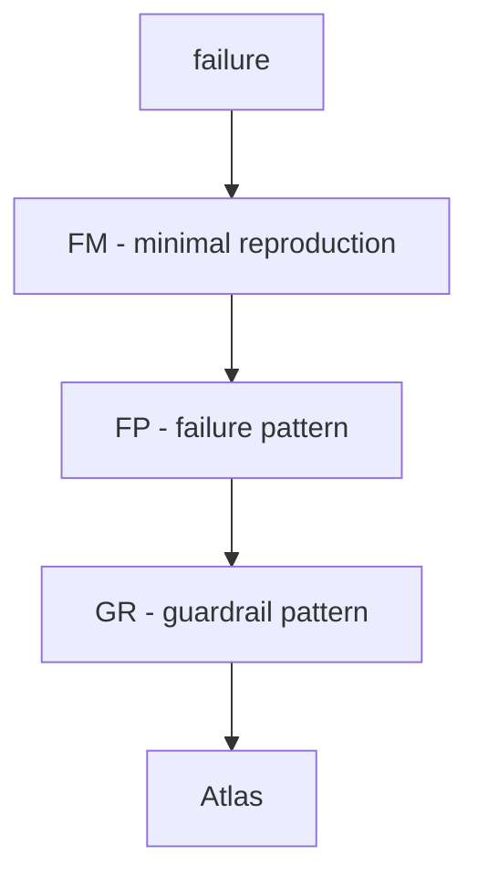

# Failure Atlas

A field guide to how complex systems fail (safely).

**Real failure → FM (prove) → FP (explain) → GR (mitigate).**

How?

> This is an engineering experiment

#### Studying classes of failure, not individual bugs

- Because bugs disappear
- Failure patterns repeat forever

---

Pipeline:
“Real failure → Minimal reproduction → Mechanism → Guardrail → Atlas update”

FM proves.
FP explains.
GR mitigates.

# example

- Real failure class: duplicate execution after retry timeout
- Failure Mode: [`FM_001_duplicate_retry`](./lab/failure_modes/FM_001_duplicate_retry/)
- Failure Pattern: [`FP_001_duplicate_execution_after_retry_timeout`](./atlas/FP_001_duplicate_execution_after_retry_timeout.md)
- Guardrail: [`GR_001_idempotent_commit_boundary`](./guardrails/GR_001_idempotent_commit_boundary.md)

# Components

## [Atlas](./atlas/)  
Explain the failure class.

Artifacts:
- `FP_XXX_name.md` entries with YAML metadata
- hidden assumption / trigger / mechanism / detection
- links to FM reproductions and GR guardrails

## [Lab](./lab/)  
Prove the failure exists.

Artifacts:
- `FM_XXX_*` bundles (`spec.md`, `scenario.py`, tests)
- deterministic reproduction (happy/repro/prevent, recover when needed)
- explicit invariant references (`INV_XXX`)

## [Guardrails](./guardrails/)  
Prove the failure can be prevented or contained.

Artifacts:
- `GR_XXX_name.md` entries with YAML metadata
- invariant-enforcing design pattern
- tradeoffs and links back to FP/FM
