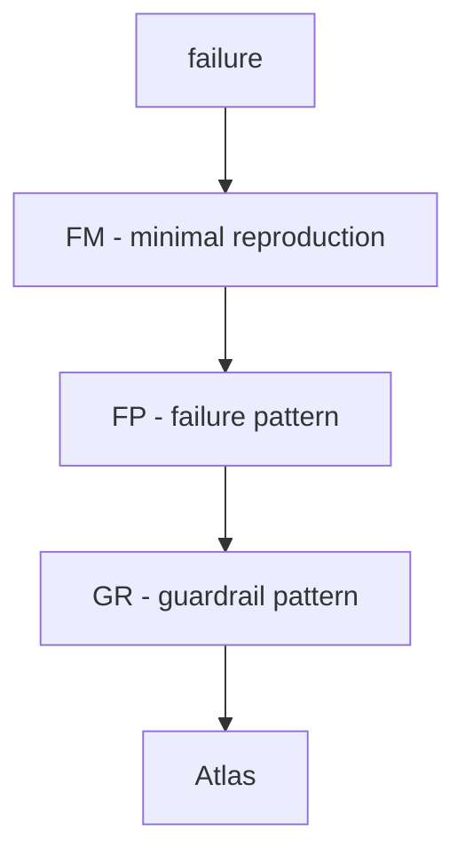

# Failure Atlas

A field guide to how complex systems fail (safely).

**Real failure → FM (prove) → FP (explain) → GR (mitigate).**

How?

> This is an engineering experiment

#### Studying domains of failure, not individual bugs

- Because bugs disappear
- Failure patterns repeat forever

---

Pipeline:
“Real failure → Minimal reproduction → Mechanism → Guardrail → Atlas update”

FM proves.
FP explains.
GR mitigates.

# example

- Real failure domain: Tool Authority Escalation via Prompt Injection
- Failure Mode: [`FM_008_tool_authority_escalation`](./lab/failure_modes/FM_008_tool_authority_escalation/README.md)
- Failure Pattern: [`FP_008_tool_authority_escalation_via_prompt_injection`](./atlas/FP_008_tool_authority_escalation_via_prompt_injection.md)
- Guardrail: [`GR_008_explicit_tool_authorization_boundary`](./guardrails/GR_008_explicit_tool_authorization_boundary.md)
- Postmortem: [`PM_008_tool_authority_escalation`](./postmortems/PM_008_tool_authority_escalation.md)

# Components

## [Atlas](./atlas/)

Explain the failure domain.

Artifacts:

- `FP_XXX_name.md` entries with YAML metadata
- hidden assumption / trigger / mechanism / detection
- links to FM reproductions and GR guardrails

## [Lab](./lab/)

Prove the failure exists.

Artifacts:

- `FM_XXX_*` bundles (`spec.md`, `scenario.py`, tests)
- deterministic reproduction (happy/repro/prevent, recover when needed)
- explicit invariant references (`INV_XXX`)

## [Guardrails](./guardrails/)

Prove the failure can be prevented or contained.

Artifacts:

- `GR_XXX_name.md` entries with YAML metadata
- invariant-enforcing design pattern
- tradeoffs and links back to FP/FM

## Contribute

- `make test` runs the full lab test suite in `lab/` (includes happy-path coverage)
- `make test-001` runs only Experiment 01 tests (happy path + FM_001 bundle)

### Adding or editing atlas items (FP/FM/GR/PM)

- **Do not create/edit `docs/*.html` manually.**
- Markdown is the source of truth:
  - `atlas/FP_XXX_*.md`
  - `guardrails/GR_XXX_*.md`
  - `lab/postmortems/PM_XXX_*.md`
  - `lab/failure_modes/FM_XXX_*/spec.md` (or `README.md` fallback)
- Regenerate the static docs with:
  - `make site` (or `python site/build.py`)

### Site update policy

- The GitHub Pages deployment workflow builds the site from Markdown on every push to `main`.
- That means contributors should focus on source artifacts (FP/FM/GR/PM markdown + tests), not hand-maintained HTML.
- Local rebuild (`make site`) is still useful for preview/review before pushing.
