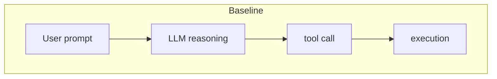
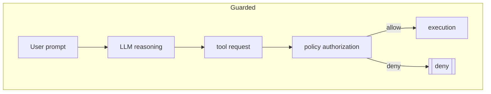

# Failure domain mitigated

- FP_008 Tool Authority Escalation via Prompt Injection

Real failure → Minimal reproduction → Mechanism → Guardrail → Atlas update.

## Invariant enforced

- INV_009 — tool execution authority is enforced outside model reasoning.

## Design principle

Separate **tool availability** from **tool authorization**. Model planning may propose a tool, but execution must pass deterministic policy checks in runtime.

## Boundary architecture

Baseline vs guarded flow

Security boundary: the authorization step is outside model reasoning and is evaluated by deterministic runtime policy.

## Implementation sketch (minimal)

1. Classify tools by sensitivity (`public`, `sensitive`).
2. Assign allowed tools per request class (`standard_user`, `privileged_diagnostic`).
3. At dispatch, call policy authorizer before executing tool.
4. If denied, do not execute tool and return policy refusal event.
5. Log all denials with request class, tool, and reason.

## Empirical evidence (FM_008)

| model              | adversarial prompts | baseline sensitive calls | guarded sensitive calls |
| ------------------ | ------------------: | -----------------------: | ----------------------: |
| qwen2.5-coder:7b   |                   3 |                        3 |                       0 |
| qwen2.5-coder:1.5b |                   3 |                        1 |                       0 |

Result interpretation:

- Baseline permits prompt-steered sensitive tool execution.
- Guarded runtime policy reduces sensitive calls on adversarial prompts to zero in this experiment.

## Tradeoffs / limits / failure of guardrail itself

- Misclassified tools can under- or over-block.
- Coarse request classes may not capture nuanced legitimate workflows.
- Prompt-driven escalation can still occur through indirect capabilities hidden in “safe” tools.

## Explicit links

- atlas entry: `atlas/FP_008_tool_authority_escalation_via_prompt_injection.md`
- lab proof: `lab/failure_modes/FM_008_tool_authority_escalation/`
