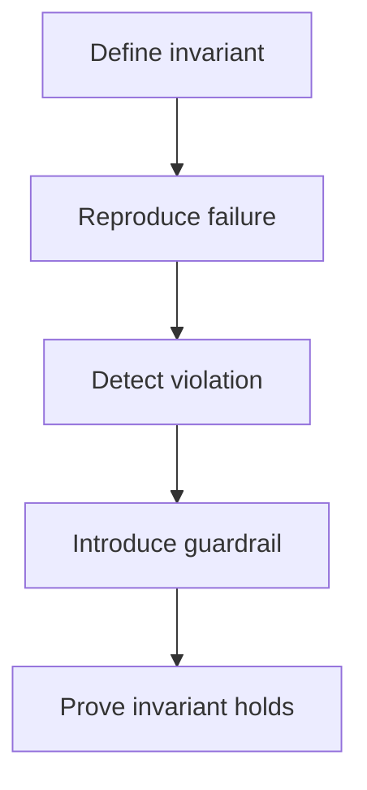

# Failure Lab

Deterministic experiments for discovering and preventing failure modes in complex systems.

> **Reproduce the failure → detect the violation → restore the invariant → prove it holds**

## Why this exists

Most failures come from small invariant violations:

- ambiguous state transitions
- retry amplification
- partial writes
- recovery logic drift

This repository turns those failures into **deterministic experiments**.

## Method

Every experiment follows the same loop:



## Failure Mode Bundle

Each failure is packaged as a reproducible bundle.

```sh
failure_modes/FM_XXX_name/

spec.md # violated invariant, trigger, detection, recovery
scenario.py # deterministic reproduction

tests/ # prove the failure and the fix
test_repro_fmxxx.py
test_prevent_fmxxx.py
test_recover_fmxxx.py
```

# Experiment 01 — Predictable Job Queue

Minimal job processor designed to demonstrate **correctness under stress**.

### Focus

- duplicate execution
- partial writes
- retry amplification
- stuck queues

### Guarantees

| Property | Guarantee                                |
| -------- | ---------------------------------------- |
| Delivery | **at-least-once**                        |
| Effects  | **exactly-once via idempotent handlers** |
| Retries  | **bounded with dead-letter fallback**    |
| Recovery | **invariants must be restored**          |

Correctness is defined by **invariants**, not uptime.

# Quick Start

```bash
make sync
make test
```

### Where to read experiment outputs
- Every test can call the shared `experiment_log` fixture. It writes JSONL to that test's temporary directory (`.../tmp*/experiment_log.jsonl`) with inputs and observed signals.
- Use `jq`/`rg` on the JSONL file after a run to compare counts across scenarios without opening test code.

## Current Failure Modes

The lab now exercises multiple invariants beyond FM_001. Run the full suite to
cover all bundles:

```bash
make sync   # install required packages
make test   # happy path + all FM bundles (001, 002, 003, 004, 008, 009, 010)
```

To focus on a single failure mode, point pytest at its bundle, e.g.:

```bash
uv run pytest failure_modes/FM_003_quota_boundary_off_by_one/tests
```

The canonical list of active FMs and their invariants lives in
`docs/failure_mode_index.md`.

## Repository Map

**Scope**  
[`docs/00_scope.md`](./docs/00_scope.md)

**Invariants**  
[`docs/01_invariants.md`](./docs/01_invariants.md)

**Failure-mode methodology**  
[`docs/03_failure_modes.md`](./docs/03_failure_modes.md)

**Happy path baseline**  
[`docs/04_happy_path.md`](./docs/04_happy_path.md)

**Failure mode index**  
[`docs/failure_mode_index.md`](./docs/failure_mode_index.md)

**Failure-mode bundles**  
`failure_modes/FM_XXX_*`

## Where this applies

This methodology applies to any system where correctness matters:

- distributed infrastructure
- financial transaction systems
- cryptographic protocols
- AI systems

The pattern is always the same:


# Philosophy

Failure is inevitable.  
Correctness is engineered.
